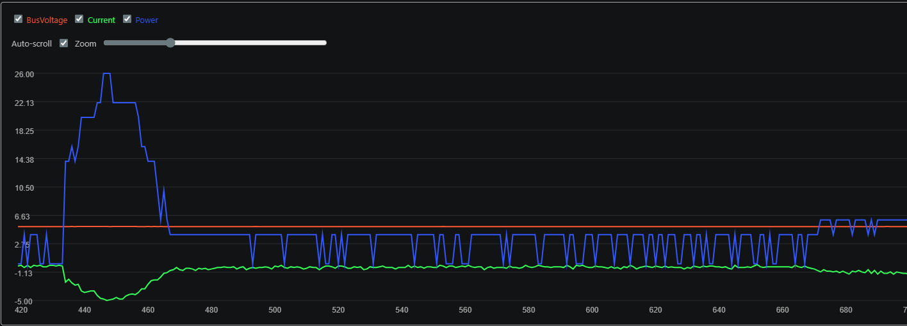
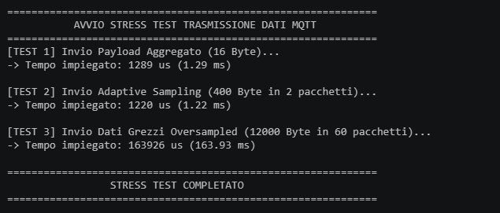

# IoT_IndividualProject
The goal of the assignment is to create an IoT system that collects information from a sensor, analyses the data locally and communicates to a nearby server an aggregated value of the sensor readings. The IoT system adapts the sampling frequency in order to save energy and reduce communication overhead. The IoT device will be based on an ESP32 prototype board and the firmware will be developed using the FreeRTOS. You are free to use IoT-Lab or real devices.

## Technical Details

The project relies on a **FreeRTOS task-based architecture** running on an ESP32 (Heltec WiFi LoRa 32 V3). To ensure smooth compilation and avoid linker errors with hardware libraries, the code uses a "Unity Build" pattern, where tasks are separated in `.hpp` files and included in `main.cpp`.

### Input Signal
Instead of a simulated sine wave, the input signal is acquired physically from the ADC of the ESP32 board using `analogRead()` on GPIO 1, with a 12-bit resolution (values from 0 to 4095).
The signal is generated throught a script created for arduino UNO (in `signal_generator` directory).

### Maximum Sampling Frequency
The Maximum Sampling Frequency of the ESP32 ADC can be very high, but to maintain a stable and realistic IoT application, a theoretical maximum boundary of `1000 Hz` is set (`MAX_SAMPLING_FREQ`).
The sampling rate is precisely controlled using FreeRTOS delays:

```cpp
vTaskDelayUntil(&xLastWakeTime, pdMS_TO_TICKS((int)(1000.0 / currentFreq)));
```
This guarantees that the task wakes up exactly at the required intervals, compensating for the execution time of the analogRead() instruction.

### Identify optimal Sampling Frequency (Adaptive FFT)
To identify the maximum frequency of the input signal and adapt the sampling rate, a True Double-Buffering mechanism is implemented.
The TaskSampling fills a 128-sample buffer (procReal and procImag). Once filled, the pointers are swapped instantly with a secondary buffer (fftReal and fftImag), and a binary semaphore (xFFTReady) triggers the TaskFFT. This ensures no data is lost while the FFT is being computed.

The ArduinoFFT library calculates the magnitudes. We isolate the highest significant frequency bin (skipping the DC component) using a magnitude threshold of 500.0:
```cpp
double f_max = (topBin * currentFreq) / (double)SAMPLES;
```

Based on the Nyquist-Shannon Sampling Theorem, the optimal sampling frequency must be at least twice the maximum frequency of the signal. To ensure a safety margin and a good reconstruction, we set:
```cpp
float recommendedFreq = f_max * 2.5;
```
The new frequency is safely shared back to the sampling task using a Mutex (freqMutex).


### Compute aggregate function over a window
The aggregate function calculates the average of the ADC values over a tumbling window.
In the TaskSampling, every read value is added to a global accumulator (windowSum) protected by windowMutex.
Every 30 seconds (when using LoRa) or 5 seconds (when using MTT), the communication task locks the mutex, extracts the sum and the sample count, computes the average, and resets the variables for the next window:
```cpp
float average = windowSum / windowCount;
```

### Communicate the aggregate value to the cloud (LoRaWAN)
By setting the global flag useLoraMode = true, the system activates TaskLora.
Using the heltec_unofficial and RadioLib libraries, the board connects to The Things Network (TTN) via ABP.
To strictly minimize bandwidth and airtime, the floating-point average is cast to an unsigned 16-bit integer and sent as a minimal 2-byte payload:
```cpp
uint16_t valToSend = (uint16_t)average;
uint8_t payload[2] = { highByte(valToSend), lowByte(valToSend) };
node.sendReceive(payload, 2, 1);
```

The task respects the LoRaWAN Fair Use Policy by enforcing a MINIMUM_DELAY of 30 seconds between each transmission.

### Communicate the aggregate value to the nearby server (MQTT)
Setting useLoraMode = false skips the LoRa initialization and starts TaskMQTT instead.
The board connects to a local WiFi hotspot and uses PubSubClient to publish a JSON or formatted string payload to the MQTT broker on the topic esp32/average.

### On-Device UI (OLED Display)
A dedicated low-priority task (TaskDisplay) visualizes the data in real-time. It plots the raw ADC signal acting as a mini-oscilloscope, while the top header displays the currently applied sampling frequency and last average value calculated.

## Performance of the system
### Energy Consumption
Instead of using Deep Sleep (which would clear the RAM and reset the FreeRTOS scheduler), energy efficiency is achieved through the RTOS Idle Task. By using vTaskDelayUntil() and semaphores (portMAX_DELAY), the CPU is yielded to the Idle state whenever tasks are waiting for data or timeouts.

During a standard execution we can identify three phases:
1. Oversampling -> The CPU gathers raw data and computes the FFT. Thanks to the ESP32's efficient FPU, mathematical operations are "cheap" and consume a baseline current (e.g., ~50-80 mA).
2. Adaptive Sampling -> Once the FFT calculates the optimal lower frequency, the system enters an adaptive sampling phase. The CPU spends most of its time in the FreeRTOS Idle state, drastically lowering the average power consumption.
3. Transmission phase -> Communicating the average of the signal over a window to a local server (MQTT) or cloud (LoRa) (up to +300mA mA).

# PLOT CONSUMPION HERE -----------



### Communication cost & Bandwidth Savings
The Adaptive Sampling logic provides massive bandwidth savings compared to sending raw data.
Instead of sending over-sampled data (e.g., 1000 Hz * 5 seconds = 12,000 samples per window), the system processes the signal locally (Edge Computing).
- Data Reduction: The system achieves a verified > 99,8% reduction in payload size (e.g., from 12,000 Bytes down to 16 Bytes per window).
- Protocol Specifics: In WiFi/MQTT mode, the data is sent as a lightweight Human-Readable JSON/String (approx. 15-20 Bytes).
- In LoRaWAN mode, the payload is further compressed via strict Binary Packing into exactly 2 Bytes. This drastically reduces the Time-on-Air (ToA) of the LoRa modulation, minimizing packet collisions, complying with fair-use policies, and drastically lowering the radio power consumption.

# PLOT DATA REDUCTION HERE -----------



### End-to-end Latency of the system
The system is designed with precise microsecond-level profiling (micros()) to track internal and network delays without interfering with the FreeRTOS scheduler.
- Execution Time: The local computation overhead is virtually zero. The FFT computation (fftDurationUs) combined with the mean aggregation takes only ~3 to 15 milliseconds, ensuring the system can easily sustain the maximum 1000 Hz sampling rate without causing bottlenecks.

- Network & E2E Latency: The system calculates the true End-to-End Generation Latency (from the moment the first physical sample is read to the moment it reaches the cloud).

- Asynchronous ACK Tracking:
    - In MQTT mode, the Edge node actively measures the Round-Trip Time (RTT) by listening for an ACK from an external Node.js Edge Server, proving sub-30ms delivery times while maintaining asynchronous, non-blocking execution.
    - In LoRa mode, a sendReceive architecture is implemented. The node requests a strict downlink response. The measured RTT successfully captures the physical Time-on-Air (ToA) of the uplink, combined with the protocol's mandatory RX1/RX2 receive windows (typically introducing a 1 to 2-second delay). This proves the FreeRTOS scheduler can handle massive latency disparities without halting the continuous background sampling of the sensors.

## Setup Guide
### Hardware Requirements
1. Heltec WiFi LoRa 32 V3 Development Board.

2. Analog sensor or Potentiometer connected to GPIO 1.

3. Antenna connected to the IPEX connector (CRITICAL for LoRa transmission).

### Hardware Requirements
1. PlatformIO IDE

2. Libraries required in platformio.ini:

    - kosme/arduinoFFT @ ^2.0.4
    - ropg/Heltec_ESP32_LoRa_v3 @ ^0.9.2
    - jgromes/RadioLib
    - ropg/LoRaWAN_ESP32
    - knolleary/PubSubClient @ ^2.8


### Execution Steps
1. Clone the repository.

2. Configure your TTN credentials (deveui, appeui, appkey) in main.cpp.

3. Choose the communication mode:
    - Set bool useLoraMode = true; to use TTN.

    - Set bool useLoraMode = false; to use WiFi/MQTT (remember to update ssid and mqtt_server).

4. Build and upload the code using PlatformIO.

5. Open the Serial Monitor at 115200 baud to see the RTOS task execution.